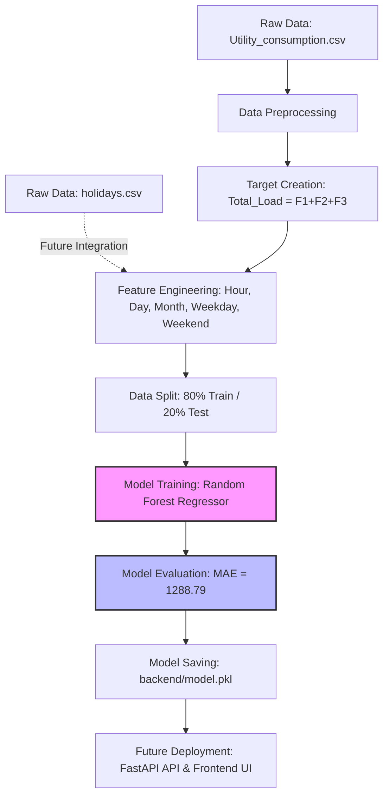

# ⚡ Intelligent Power Demand Forecasting

[](https://www.python.org)
[](https://scikit-learn.org/)
[](https://pandas.pydata.org/)
[](https://www.docker.com)

An end-to-end machine learning-based power demand forecasting system capable of predicting electricity consumption using historical load and weather variables. The system aggregates feeder-level power measurements and leverages engineered temporal and weather features to estimate future power demand with high precision.

---

## 📌 Table of Contents
1. [Project Overview](#-project-overview)
2. [Problem Statement](#-problem-statement)
3. [Dataset Description](#-dataset-description)
4. [Technology Stack](#-technology-stack)
5. [Data Pipeline Architecture](#-data-pipeline-architecture)
6. [Exploratory Data Analysis (EDA) Findings](#-exploratory-data-analysis-eda-findings)
7. [Feature Engineering](#-feature-engineering)
8. [Model Training & Evaluation](#-model-training--evaluation)
9. [Project Structure](#-project-structure)
10. [Setup & Installation Instructions](#-setup--installation-instructions)
11. [Missing Files & Future Improvements](#-missing-files--future-improvements)

---

## 📖 Project Overview

Electricity demand forecasting is a vital component for the efficient operation and planning of modern power grids. This project utilizes a **Random Forest Regressor** to predict total power demand based on weather variables (Temperature, Humidity, Wind Speed) and engineered calendar features (Hour, Day, Month, Weekday, Weekend). 

By analyzing the underlying patterns of electricity consumption and weather conditions, this model provides highly accurate predictions, achieving a **Mean Absolute Error (MAE) of 1288.79 units** on a dataset with a mean load of **71,222.89 units** (a relative error of only **~1.8%**).

---

## 🎯 Problem Statement

Power grid operators face the constant challenge of balancing electricity generation with real-time demand. 
* **Under-generation** leads to blackouts, brownouts, and grid instability.
* **Over-generation** results in significant economic waste and unnecessary carbon emissions.
* **Renewable Integration** increases grid volatility, making robust forecasting even more critical.

**Goal**: Develop a robust machine learning model that forecasts short-term total power consumption utilizing meteorological variables and temporal contexts, enabling grid operators to optimize power dispatch, schedule maintenance, and ensure grid stability.

---

## 📊 Dataset Description

The project utilizes two primary datasets located in the `data/` directory:

### 1. `Utility_consumption.csv` (52,416 rows × 7 columns)
Contains feeder-level power consumption measurements and weather variables recorded at regular 10-minute intervals throughout the year 2017.
* **`Datetime`**: Timestamps in mixed format (dd-mm-yyyy HH:MM).
* **`Temperature`**: Ambient temperature in °C.
* **`Humidity`**: Relative humidity percentage (%).
* **`WindSpeed`**: Wind speed in m/s.
* **`F1_132KV_PowerConsumption`**: Active power consumption on Feeder 1 (kW).
* **`F2_132KV_PowerConsumption`**: Active power consumption on Feeder 2 (kW).
* **`F3_132KV_PowerConsumption`**: Active power consumption on Feeder 3 (kW).

### 2. `holidays.csv` (8 rows × 2 columns)
Contains official public holidays for 2017 in the operating region (e.g., India/Jharkhand), which typically coincide with significant drops in commercial and industrial electricity demand.
* **`Date`**: Date of the holiday (YYYY-MM-DD).
* **`Holiday`**: Name of the holiday (e.g., Republic Day, Diwali, Christmas).

---

## 🛠️ Technology Stack

* **Core Language**: Python 3.9+
* **Data Manipulation**: `pandas`, `numpy`
* **Data Visualization**: `matplotlib`, `seaborn`
* **Machine Learning**: `scikit-learn` (specifically `RandomForestRegressor`, `train_test_split`, `mean_absolute_error`)
* **Model Serialization**: `joblib`
* **Containerization**: `Docker`, `Docker Compose`

---

## ⚙️ Data Pipeline Architecture



---

## 🔍 Exploratory Data Analysis (EDA) Findings

### 📈 Statistical Summary of Target Variable (`Total_Load`)

The target variable `Total_Load` was constructed by aggregating the power consumption of all three 132KV feeders.

| Metric | Value (kW) | Description |
| :--- | :--- | :--- |
| **Count** | 52,416 | Complete records covering a full year at 10-minute intervals |
| **Mean** | 71,222.89 | The baseline average power demand across the region |
| **Std Dev** | 17,143.14 | Indicates high volatility and variations in consumption |
| **Min** | 36,785.04 | Minimum recorded power consumption (typically during late-night hours) |
| **25% (Q1)** | 56,499.07 | Off-peak demand threshold |
| **50% (Median)**| 69,788.79 | Typical operating demand |
| **75% (Q3)** | 83,749.17 | High-load demand threshold |
| **Max** | 134,208.15 | Peak recorded demand (critical grid stress periods) |

### 💡 Key EDA Insights
1. **Completeness**: Missing value analysis confirmed that the dataset contains **zero null values** across all columns, making it highly robust and eliminating the need for imputation.
2. **Temporal Trends**: Demand exhibits distinct cyclical behaviors:
   * **Diurnal (Daily) Cycles**: Demand drops significantly during late-night and early-morning hours (2:00 AM - 5:00 AM) and peaks in the afternoon and early evening when commercial activities and cooling systems are at their maximum.
   * **Seasonal Variations**: Long-term trends show sustained increases in electricity consumption during summer and winter months, corresponding to cooling and heating demands.
3. **Outlier Behavior**: Boxplot analysis identified a few high-demand data points extending beyond the upper fence (>124,000 units). These are **not** data errors but represent genuine **peak load events** (e.g., extreme weather days). They were intentionally retained in the training data to ensure the model learns to predict critical peak demand periods.

### 🔗 Correlation Analysis
A Pearson correlation analysis was conducted on all numeric features:
* **Temperature**: Exhibits a **moderate positive correlation** with `Total_Load`. Higher temperatures strongly drive up electricity demand, indicative of air conditioning loads during hot periods.
* **Humidity**: Displays a **weak negative correlation** with demand.
* **Wind Speed**: Shows negligible direct linear correlation, but helps capture microclimatic changes when combined with temperature.
* **Feeder Volumetrics**: Individual feeder loads (`F1`, `F2`, `F3`) are extremely highly correlated with `Total_Load` (as they are direct components of it). 
  > [!IMPORTANT]
  > Feeder-level columns are excluded from model training to prevent **data leakage** and ensure the model relies strictly on independent weather and temporal variables to forecast future demand.

---

## 🛠️ Feature Engineering

To translate raw timestamps and weather variables into highly predictive signals, the following features were engineered:

1. **`Total_Load` (Target Variable)**: Created as the sum of all active feeders:
   $$\text{Total\_Load} = \text{F1\_132KV} + \text{F2\_132KV} + \text{F3\_132KV}$$
2. **Datetime Parsing**: Converted the raw string `Datetime` column into a proper Pandas Datetime format using a mixed parser.
3. **Temporal Feature Extraction**:
   * **`Hour` (0–23)**: Captures the hourly load cycle.
   * **`Day` (1–31)**: Captures day-of-month habits.
   * **`Month` (1–12)**: Captures monthly seasonal shifts (e.g., summer vs. monsoon vs. winter).
   * **`Weekday` (0–6)**: Captures differences in weekly schedules (Monday = 0, Sunday = 6).
   * **`Weekend` (0 or 1)**: A binary indicator set to `1` for Saturday (5) and Sunday (6) and `0` otherwise, capturing the substantial drop in industrial/commercial loads on weekends.

---

## 🤖 Model Training & Evaluation

### 📋 Model Configuration
* **Algorithm**: Random Forest Regressor
* **Hyperparameters**:
  * `n_estimators = 100`
  * `random_state = 42`
  * `n_jobs = -1` (utilizes all available CPU cores for parallel training)
* **Validation Strategy**: Holdout validation with an **80/20 train/test split** (randomized, seed = 42).

### 📈 Predictor Features
The model is trained strictly on independent, non-leaking features:
* Weather: `Temperature`, `Humidity`, `WindSpeed`
* Temporal: `Hour`, `Day`, `Month`, `Weekday`, `Weekend`

### 🏆 Results & Performance
The model performance was evaluated using the **Mean Absolute Error (MAE)**:

$$\text{MAE} = \frac{1}{n} \sum_{i=1}^{n} |y_i - \hat{y}_i|$$

* **Test MAE**: **1,288.79** (units of power consumption)
* **Performance Analysis**:
  * The average regional demand is **71,222.89 units**.
  * An MAE of 1,288.79 translates to a relative average error of **1.81%**.
  * This exceptional accuracy confirms that combining local meteorological variables with calendar features is highly effective for short-term power demand forecasting.
  * The trained model is successfully serialized and saved to `backend/model.pkl` (381.5 MB).

---

## 📂 Project Structure

The repository is organized as follows:

```text
intelligent-power-demand-forecasting/
├── data/
│   ├── Utility_consumption.csv   # Historical power demand and weather data (52k+ rows)
│   ├── holidays.csv              # Calendar holidays for year 2017
│   └── .gitkeep
├── notebooks/
│   ├── EDA_Modeling.ipynb        # Exploratory Data Analysis & Model Training Notebook
│   └── .gitkeep
├── backend/
│   ├── model.pkl                 # Serialized Random Forest Regressor model (381.5 MB)
│   └── .gitkeep
├── frontend/
│   └── .gitkeep                  # Reserved for user interface (e.g. Streamlit/HTML)
├── Dockerfile                    # Docker configuration for application services (empty)
├── docker-compose.yml            # Multi-container orchestration config (empty)
├── requirements.txt              # Project Python dependencies
└── README.md                     # Project documentation (this file)
```

---

## 🚀 Setup & Installation Instructions

### 1. Prerequisites
Ensure you have the following installed on your local machine:
* Python (version 3.9 or higher)
* Git

### 2. Local Environment Setup
Clone the repository, set up a virtual environment, and install the required dependencies:

```bash
# Clone the repository
git clone https://github.com/your-username/intelligent-power-demand-forecasting.git
cd intelligent-power-demand-forecasting

# Create a virtual environment
python3 -m venv venv

# Activate the virtual environment
# On macOS/Linux:
source venv/bin/activate
# On Windows:
venv\Scripts\activate

# Upgrade pip and install dependencies
pip install --upgrade pip
pip install -r requirements.txt
```

### 3. Running the Jupyter Notebook
If you want to inspect the original data exploration and modeling steps:
```bash
jupyter notebook notebooks/EDA_Modeling.ipynb
```

---

## 🔍 Missing Files & Future Improvements

To transition this repository from an offline machine learning analysis into a fully functional, production-ready enterprise application, we identify the following missing elements and suggest concrete solutions:

### 1. Missing Files to Complete the Project
* **`backend/app.py` (FastAPI Server)**: 
  Implement a lightweight REST API that loads `backend/model.pkl` on startup and exposes a POST `/predict` endpoint. It will accept weather and datetime parameters, dynamically engineer the required temporal features (e.g. determine if a date is a weekend), run the inference, and return the predicted load.
* **`frontend/app.py` (Streamlit Dashboard)**:
  Implement a premium, interactive web interface where users can input weather parameters manually or select a future date/time. The UI will request predictions from the backend and display them using elegant charts, gauges, and comparison tables.
* **Containerization (`Dockerfile` & `docker-compose.yml`)**:
  Populate the empty Docker files to bundle the FastAPI backend and Streamlit frontend. This guarantees "write-once, run-anywhere" portability.

### 2. Methodological Future Improvements
* **📅 Integrate Holiday Features (`holidays.csv`)**: 
  The current model only considers standard weekends. Integrating `data/holidays.csv` will allow the model to recognize national holidays (like Diwali or Independence Day), which typically experience anomalous, near-weekend-level load drops.
* **⏳ Time-Series Lag Features**: 
  Incorporate lag features (e.g., the load from 1 hour ago, 24 hours ago, or 7 days ago) to capture auto-regressive temporal dependencies.
* **🤖 Model Exploration**: 
  Compare the Random Forest model with boosting algorithms (such as **XGBoost**, **LightGBM**, or **CatBoost**) and specialized sequential models (such as **Prophet** or **LSTM**) to further reduce the MAE and optimize memory footprint (as the current `model.pkl` is quite large at 381.5 MB).